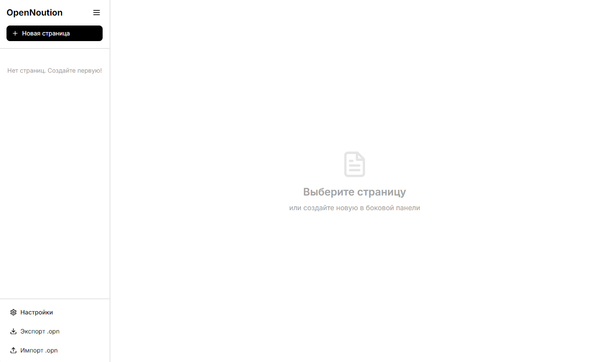
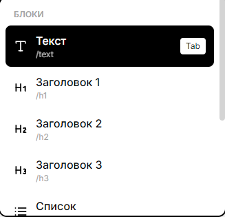
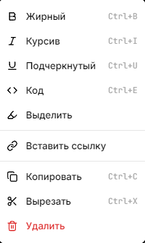

<div align="center">
  
  
  <p align="center">
    <strong>Free & Open Source Notion Alternative</strong>
  </p>
  
  <p align="center">
    Минималистичный, быстрый и приватный редактор заметок<br/>
    с блочной структурой, slash командами и локальным хранением
  </p>

  <p align="center">
    <a href="#-quick-start"><strong>Quick Start</strong></a> ·
    <a href="#-features"><strong>Features</strong></a> ·
    <a href="#-documentation"><strong>Docs</strong></a> ·
    <a href="#-contributing"><strong>Contributing</strong></a>
  </p>

  <p align="center">
    
    
    
    
    
  </p>
</div>

---

## 📖 Table of Contents

- [Overview](#-overview)
- [Features](#-features)
- [Quick Start](#-quick-start)
- [Usage Guide](#-usage-guide)
- [Tech Stack](#-tech-stack)
- [Project Structure](#-project-structure)
- [Roadmap](#-roadmap)
- [Contributing](#-contributing)
- [License](#-license)

---

## 🌟 Overview

**OpenNoution** - это современная альтернатива Notion, созданная с фокусом на:

- **Минимализм** - чистый черно-белый дизайн без отвлекающих элементов
- **Скорость** - молниеносная работа благодаря локальному хранению
- **Приватность** - все данные остаются на вашем устройстве
- **Бесплатность** - полностью бесплатно навсегда, без подписок
- **Open Source** - открытый исходный код под MIT лицензией

<div align="center">
  
  <p><em>Main application interface</em></p>
</div>

## Features

- **Минималистичный дизайн** - черно-белый интерфейс с плавными анимациями
- **Локальное хранение** - все данные хранятся на вашем устройстве (IndexedDB)
- **Блочный редактор** - как в Notion (текст, заголовки, списки, чеклисты, цитаты, код)
- **Slash команды** - введите `/` для быстрого выбора типа блока (Tab для автозаполнения)
- **Контекстное меню** - выделите текст и нажмите ПКМ для форматирования (жирный, курсив, код и др.)
- **Иерархия страниц** - создавайте подстраницы и организуйте контент
- **Экспорт/Импорт** - сохраняйте бэкапы в формате `.opn`
- **Быстрый старт** - красивый опросник при первом запуске
- **Анимации** - GSAP + Framer Motion для плавного UX
- **Приватность** - данные остаются только у вас

### Core Features

| Feature | Description |
|---------|-------------|
| **Block Editor** | 7 типов блоков: текст, заголовки (H1-H3), списки, чеклисты, цитаты, код |
| **Slash Commands** | Введите `/` для быстрого выбора типа блока с автодополнением |
| **Context Menu** | ПКМ на выделенном тексте для форматирования (жирный, курсив, код и др.) |
| **Page Hierarchy** | Неограниченная вложенность страниц и подстраниц |
| **Export/Import** | Бэкапы в собственном формате `.opn` |
| **Beautiful UI** | Плавные анимации с GSAP и Framer Motion |
| **Onboarding** | Красивый опросник при первом запуске |
| **100% Local** | Все данные в IndexedDB, без облака |

---

## Quick Start

### Download (Recommended)

**Скачайте готовое приложение:**

- **Windows:** [OpenNoution-Setup.exe](https://github.com/Deithand/OpenNoution/releases)
- **macOS:** [OpenNoution.dmg](https://github.com/Deithand/OpenNoution/releases)
- **Linux:** [OpenNoution.AppImage](https://github.com/Deithand/OpenNoution/releases)

### Build from Source

**Prerequisites:**
- **Node.js** 18 или выше
- **npm** или **yarn**

**Installation:**

```bash
# Clone the repository
git clone https://github.com/Deithand/OpenNoution
cd OpenNoution

# Install dependencies
npm install

# Run development server
npm run dev
```

Приложение откроется автоматически через несколько секунд! 🎉

### Build for Production

```bash
# Build for current platform
npm run build:electron

# Or build for specific platforms:
npm run build:win      # Windows (NSIS + Portable)
npm run build:mac      # macOS (DMG + ZIP)
npm run build:linux    # Linux (AppImage + DEB + RPM)

# Build for all platforms
npm run build:all
```

**See [BUILD.md](BUILD.md) for detailed build instructions.**

---

## Usage Guide

### Slash Commands (`/`)

<table>
<tr>
<td width="50%">

**Как использовать:**
1. Создайте блок
2. Введите `/`
3. Начните печатать
4. Нажмите `Tab` для выбора

**Команды:**
- `/text` - Текст
- `/h1`, `/h2`, `/h3` - Заголовки
- `/list` - Список
- `/todo` - Чеклист
- `/quote` - Цитата
- `/code` - Код

</td>
<td width="50%">



</td>
</tr>
</table>

### Context Menu (Right Click)

<table>
<tr>
<td width="50%">



</td>
<td width="50%">

**Форматирование:**
- **Жирный** - `**text**`
- *Курсив* - `*text*`
- <u>Подчеркнутый</u> - `<u>text</u>`
- `Код` - `` `text` ``
- ==Выделение== - `==text==`
- [Ссылка](url) - `[text](url)`

**Действия:**
- Копировать, Вырезать, Удалить

</td>
</tr>
</table>

### Keyboard Shortcuts

| Shortcut | Action |
|----------|--------|
| `Enter` | Создать новый блок |
| `Backspace` | Удалить пустой блок |
| `/` | Открыть slash меню |
| `Tab` | Выбрать в меню |
| `Esc` | Закрыть меню |
| `Ctrl+B` | Жирный (в контекстном меню) |
| `Ctrl+I` | Курсив (в контекстном меню) |

---

## Tech Stack

- **React 18** - современный UI фреймворк
- **Electron** - кроссплатформенное десктопное приложение
- **Tailwind CSS** - утилитарные стили
- **GSAP** - профессиональные анимации
- **Framer Motion** - декларативные React анимации
- **Dexie.js** - удобная работа с IndexedDB
- **Zustand** - минималистичный state менеджмент
- **Lucide React** - красивые иконки
- **Vite** - быстрая сборка

### Frontend
- **React 18** - UI library
- **Vite** - Build tool & dev server
- **Tailwind CSS** - Utility-first CSS
- **Framer Motion** - Declarative animations
- **GSAP** - Professional animations
- **Lucide React** - Beautiful icons

### Desktop
- **Electron 28** - Cross-platform desktop app
- **Electron Builder** - App packaging

### State & Data
- **Zustand** - Lightweight state management
- **Dexie.js** - IndexedDB wrapper
- **React Router** - Client-side routing

## Project Structure

```
OpenNoution/
├── electron/           # Electron main process
│   ├── main.js        # Главный процесс
│   └── preload.js     # Preload скрипт
├── src/
│   ├── components/    # React компоненты
│   │   ├── Onboarding.jsx
│   │   ├── Sidebar.jsx
│   │   └── Editor.jsx
│   ├── db/           # База данных
│   │   └── database.js
│   ├── store/        # State менеджмент
│   │   └── useStore.js
│   ├── App.jsx       # Главный компонент
│   ├── main.jsx      # Точка входа
│   └── index.css     # Глобальные стили
├── package.json
├── vite.config.js
└── tailwind.config.js
```

### Export & Import

**Export Backup:**
```bash
Sidebar → Export .opn → Choose location → Save
```

**Import Backup:**
```bash
Sidebar → Import .opn → Select file → Restore
```

⚠️ **Warning:** Import will replace all current data!

---

## Roadmap

- [ ] Облачная синхронизация (платная подписка)
- [ ] Темная тема
- [ ] Markdown импорт/экспорт
- [ ] Поиск по страницам
- [ ] Горячие клавиши
- [ ] Drag & drop для блоков
- [ ] Встраивание изображений
- [ ] Таблицы
- [ ] Шаблоны страниц
- [ ] Мобильное приложение

### Version 1.2
- [ ] Dark theme
- [ ] Markdown export
- [ ] Image embedding
- [ ] Tables
- [ ] Full-text search

### Version 1.3
- [ ] Advanced keyboard shortcuts
- [ ] Page templates
- [ ] Tags system
- [ ] Mobile app

### Version 2.0
- [ ] Cloud sync (paid)
- [ ] Collaboration
- [ ] Public pages
- [ ] API & Integrations

---

## Contributing

Мы приветствуем любой вклад! Если вы хотите помочь:

1. Форкните репозиторий
2. Создайте ветку для вашей фичи (`git checkout -b feature/AmazingFeature`)
3. Закоммитьте изменения (`git commit -m 'Add some AmazingFeature'`)
4. Запушьте в ветку (`git push origin feature/AmazingFeature`)
5. Откройте Pull Request

### How to Contribute

1. **Fork** the repository
2. **Create** a feature branch (`git checkout -b feature/AmazingFeature`)
3. **Commit** your changes (`git commit -m 'Add AmazingFeature'`)
4. **Push** to the branch (`git push origin feature/AmazingFeature`)
5. **Open** a Pull Request

### Development Setup

```bash
# Install dependencies
npm install

# Run in development mode
npm run dev

# Build for production
npm run build

# Lint code
npm run lint
```

### Guidelines

- Write clean, readable code
- Follow existing code style
- Add comments for complex logic
- Test your changes
- Update documentation

---

## License

Этот проект распространяется под лицензией MIT. Смотрите файл `LICENSE` для подробностей.

## Acknowledgments

- **[Notion](https://notion.so)** - For the inspiration
- **Open Source Community** - For amazing libraries and tools
- **Contributors** - Everyone who helps improve OpenNoution

---

## Support

- **Documentation** - [Read the docs](FEATURES.md)
- **Bug Reports** - [Open an issue](https://github.com/yourusername/opennoution/issues)
- **Feature Requests** - [Start a discussion](https://github.com/yourusername/opennoution/discussions)
- **Star** - If you like OpenNoution, give it a star!

---

<div align="center">
  <p>
    <strong>Made with ❤️ by the Open Source Community</strong>
  </p>
  <p>
    <a href="https://github.com/Deithand/OpenNoution">GitHub</a> ·
    <a href="FEATURES.md">Features</a> ·
    <a href="CHANGELOG.md">Changelog</a> ·
    <a href="LICENSE">License</a>
  </p>
  <p>
    <sub>If you found this project helpful, please consider giving it a ⭐️</sub>
  </p>
</div>
